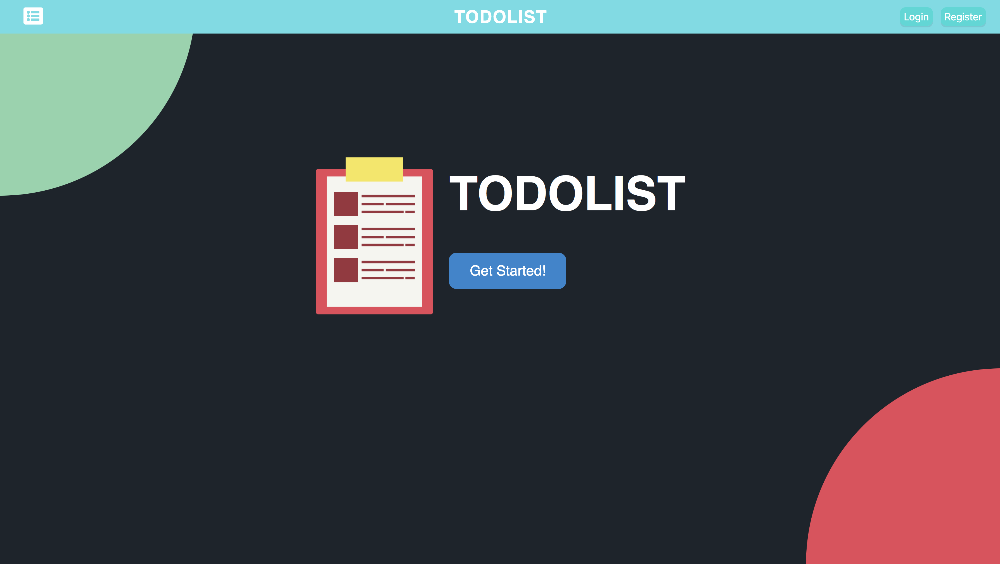
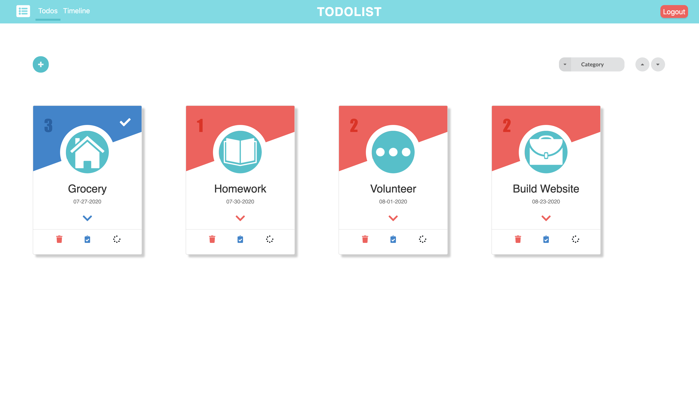
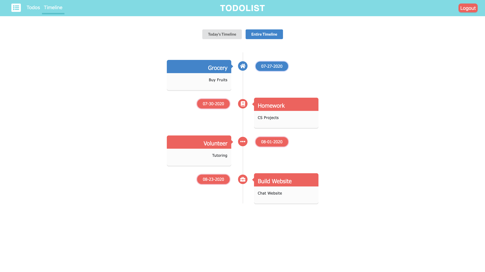

### TODOLIST

---

Website: https://dylan-todolist.herokuapp.com/
 

#### Examples:

---

#### Description:

- Users can sign up and log in to the app and receive emails from the server for verification by using `Nodemailer` and `Json Web Token`.
- Once users are logged in, they can create daily todos.
- These created todo items can be viewed in the form of cards or timeline
- These cards of todo items can be sorted based on several categories such as the created date, category and so on
- The timeline of todo items is displayed based on the due dates

---

#### Tech Stack:

- Use `React` as the library and `nextjs` as the framework for `React`.
- Database: MongoDB
- Client-side: HTML, CSS, Javascript (ReactJS)
- Server-side: Node.js

---

#### Deployment:

- `npm install`
- `cp .env.sample .env` And generate the keys after `=`
